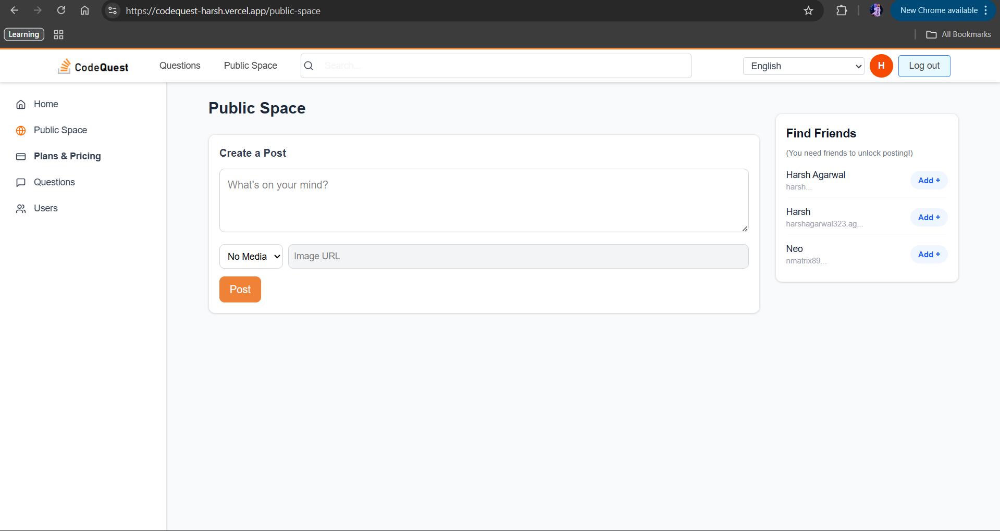
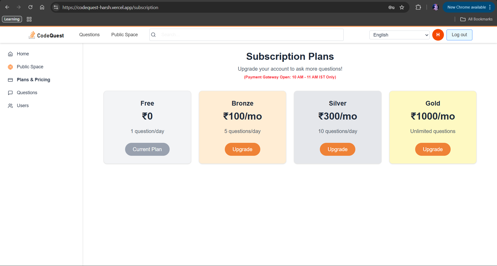

<div align="center">
  <h1>🚀 CodeQuest</h1>
  <p><strong>A Full-Stack Collaborative Q&A Platform with Gamification & Social Features</strong></p>
  
  <p>
    <a href="https://nextjs.org/">
      
    </a>
    <a href="https://nodejs.org/">
      
    </a>
    <a href="https://www.mongodb.com/">
      
    </a>
    <a href="https://expressjs.com/">
      
    </a>
    <a href="https://www.typescriptlang.org/">
      
    </a>
  </p>
</div>

---

## 🎯 Overview

**CodeQuest** is a feature-rich clone of Stack Overflow built using the MERN stack (Next.js). Beyond standard Q&A functionality, it introduces advanced features like a social "Public Space" with friend-based posting limits, a tiered subscription model with mock payments, a gamified rewards system, and robust security protocols including login tracking and multi-language OTP verification.

- **Frontend:** Next.js (TypeScript)
- **Backend:** Node.js & Express
- **Database:** MongoDB Atlas

---

## 📸 Screenshots

### Home & Questions Feed


### Public Space (Social Feed)


### Subscription Plans


### User Rewards & Wallet


---

## ✨ Key Features

### ❓ **Core Q&A Engine**
- Post questions, write answers, and comment.
- **Voting System:** Upvote/Downvote questions and answers.
- Search functionality and tag-based filtering.

### 🌐 **Public Space (Social Hub)**
- Users can post status updates/media.
- **Friend-Based Limits:** - 0 Friends: Posting locked.
  - 1 Friend: 1 Post/day.
  - 2 Friends: 2 Posts/day.
  - 10+ Friends: Unlimited posting.
- Connect with other users via the "Find Friends" sidebar.

### 💳 **Subscription System (Mock Payment)**
- **Plans:** Free (1 Q/day), Bronze (5 Q/day), Silver (10 Q/day), Gold (Unlimited).
- **Time-Gated Payment:** Gateway opens only **10:00 AM - 11:00 AM IST**.
- Simulates Invoice generation and email notifications upon upgrade.

### 🏆 **Gamification & Rewards**
- **Earn Points:** +5 points per answer, +5 bonus for upvotes.
- **Penalty:** -5 points for deleting answers.
- **Point Transfer:** Users can transfer points to peers (Sender must have >10 points).

### 🔒 **Advanced Security**
- **Login Tracking:** Captures IP, OS, and Browser type.
- **Mobile Restriction:** Mobile devices can only access the app between **10:00 AM - 1:00 PM**.
- **Forgot Password:** Secure reset flow restricted to **1 request per day**.

### 🌍 **Multi-Language Support**
- Supports: English, French, Spanish, Hindi, Portuguese, Chinese.
- **Security Check:** - Switching to French triggers **Email OTP**.
  - Switching to other languages triggers **Mobile OTP**.

---

## 🛠️ Tech Stack

| Layer | Technologies |
|-------|-------------|
| **Frontend** | Next.js, TypeScript, Tailwind CSS, Axios, Context API |
| **Backend** | Node.js, Express.js, Mongoose, JWT |
| **Database** | MongoDB Atlas |
| **Localization** | i18next, react-i18next |
| **Tools** | Nodemon, Dotenv, Bcrypt, Moment.js |

---

## 📋 Prerequisites

Before running this project, ensure you have the following installed:

- **Node.js** v16.0 or higher
- **npm** or **yarn**
- **MongoDB Atlas** connection string

---

## 🚀 Quick Start

### 1️⃣ Clone the Repository

```bash
git clone [https://github.com/yourusername/codequest.git](https://github.com/yourusername/codequest.git)
cd codequest

2️⃣ Backend Setup
Navigate to the server folder and install dependencies:

cd server
npm install

Create a .env file in the server/ directory:

PORT=5000
CONNECTION_URL=your_mongodb_connection_string
JWT_SECRET=your_secret_key

Start the backend server:

npm start

Backend runs at: http://localhost:5000

3️⃣ Frontend Setup
Open a new terminal, navigate to the frontend folder (stack), and install dependencies:

cd stack
npm install

Create a .env file in the stack/ directory:

NEXT_PUBLIC_BACKEND_URL=http://localhost:5000

Start the frontend application:

npm run dev

Frontend runs at: http://localhost:3000

📁 Project Structure

codequest/
├── server/                  # Backend Logic
│   ├── controllers/         # Auth, Question, Answer, Payment Logic
│   ├── models/              # Mongoose Schemas (User, Question, Post)
│   ├── routes/              # API Routes
│   ├── middleware/          # Auth & Security Middleware
│   └── index.js             # Entry Point
│
├── stack/                   # Frontend (Next.js)
│   ├── public/              # Assets & Locales (i18n)
│   ├── src/
│   │   ├── components/      # UI Components (Navbar, Sidebar)
│   │   ├── pages/           # Routes (Auth, Questions, Subscription)
│   │   ├── lib/             # API Services & Context
│   │   └── styles/          # Global CSS
│   └── package.json
└── README.md


🌐 API Reference
POST /payment/subscribe
Upgrades user plan. Restricted to 10-11 AM IST.

POST /posts/create
Creates a social post. Rate limited based on friend count.

POST /user/transfer-points
Transfers reward points between users.

POST /user/otp/generate
Generates OTP for language switching security.

👨‍💻 Author
**Harsh Agarwal**

[](https://github.com/Harsh427744)
[](https://linkedin.com/in/harsh323)

---


<div align="center">
  <p>⭐ If you found this project interesting, consider giving it a star!</p>
  <p>Built with ❤️ by Harsh Agarwal</p>
</div>

