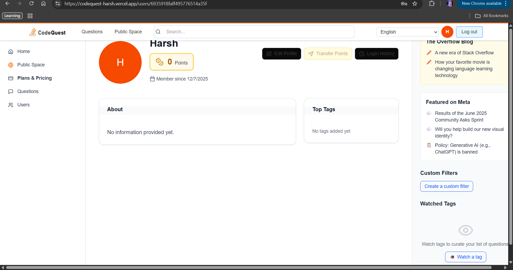
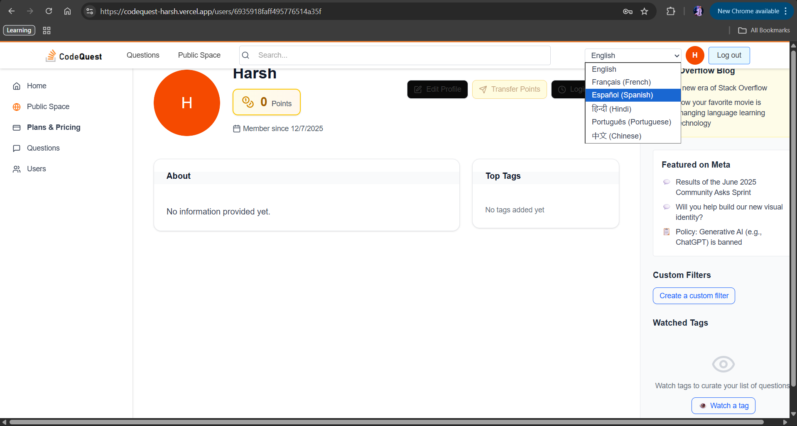
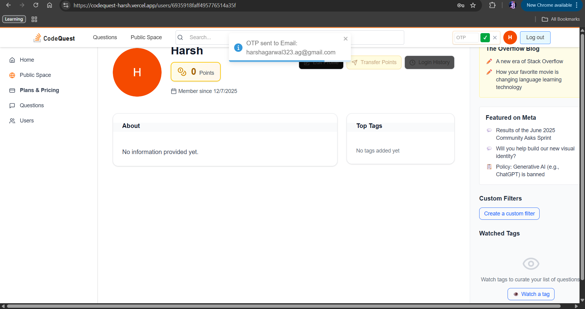
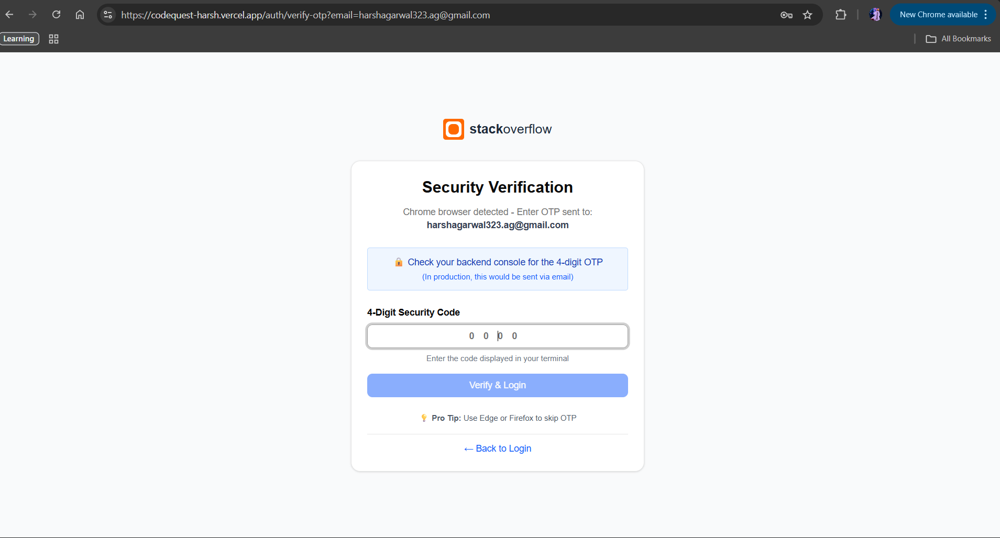
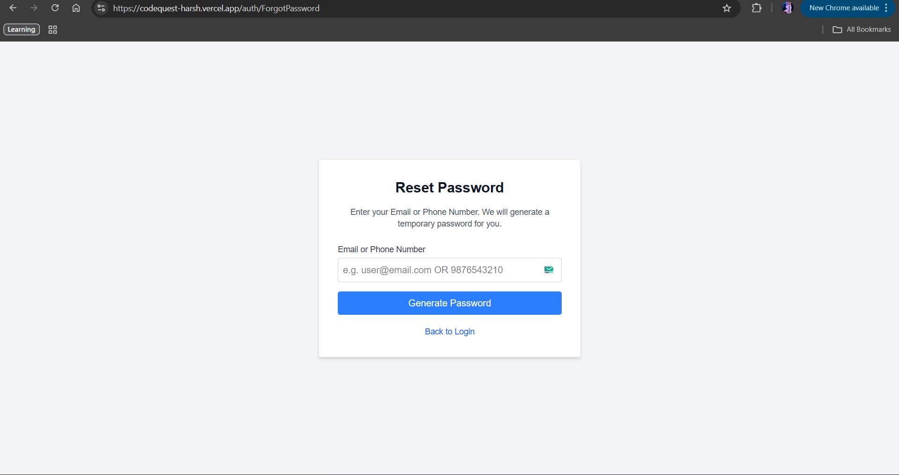

  <h1>🚀 CodeQuest</h1>
  
<strong>A Full-Stack Collaborative Q&A Platform with Gamification & Social Features</strong>

  

    <a href="https://codequest-harsh.vercel.app" target="_blank"><b>🔗 Live Demo (Vercel)</b></a> •
    <a href="https://codequest-harsh.onrender.com" target="_blank"><b>🌐 Backend API (Render)</b></a>
  

  
  

    
    
    
    
    
  

---

## 🎯 Overview

**CodeQuest** is a feature-rich Stack Overflow–style platform built using the MERN stack (Next.js on the frontend, Node/Express on the backend). It goes beyond standard Q&A by adding:

- A social **Public Space** with friend-based posting limits  
- A **subscription system** with time-gated mock payments  
- A gamified **reward system** and point transfers  
- **Multi-language** support with OTP security  
- **Login/device tracking** and time-based access rules  

Deployed on:

- **Frontend:** Vercel – https://codequest-harsh.vercel.app  
- **Backend:** Render – https://codequest-harsh.onrender.com  

---

## 📸 Screenshots

_All screenshots are stored in the `/screenshots` folder in the repo._

### Home & Questions Feed

### Public Space (Social Feed)

### Subscription Plans

### User Rewards & Wallet

### Language Switch & OTP Flow
  

### Login Verification & History

### Reset Password

### Render Console Logs (OTP)
  

---

## ✨ Key Features

### ❓ Core Q&A Engine
- Post questions, answers, and comments.
- Upvote/downvote questions and answers.
- Tag-based filtering and search.

### 🌐 Public Space (Social Hub)
- Users share posts with images/videos, like, comment, and share.
- **Friend-based posting limits:**
  - 0 friends → cannot post.
  - 1 friend → 1 post/day.
  - 2 friends → 2 posts/day.
  - ≥10 friends → unlimited posts/day.

### 💳 Subscription System (Mock Payment)
- Plans:
  - **Free:** 1 question/day.
  - **Bronze:** ₹100/month – 5 questions/day.
  - **Silver:** ₹300/month – 10 questions/day.
  - **Gold:** ₹1000/month – unlimited questions/day.
- Payment allowed only between **10:00 AM – 11:00 AM IST**.
- After payment, invoice/plan details are sent to the user via email (mocked in logs / mailer).

### 🏆 Gamification & Rewards
- +5 points for each answer.
- +5 bonus points when an answer reaches 5 upvotes.
- Points reduced when an answer is removed or downvoted.
- Users can **transfer points** to others if they have more than 10 points.

### 🔒 Advanced Security & Login Rules
- Track login IP, browser, OS, and device type.
- Show login history in the user profile.
- If user logs in via **Chrome**, access can require OTP.
- If user logs in via **Microsoft Edge**, allow direct access without extra OTP.
- If the device is **mobile**, restrict access to **10:00 AM – 1:00 PM IST** only.

### 🌍 Multi-Language Support
- Supported languages: **English, French, Spanish, Hindi, Portuguese, Chinese**.
- Switching to **French** triggers **email OTP verification**.
- Switching to any other language triggers **mobile OTP verification**.
- The entire UI (navigation, labels, major screens) updates to the selected language.

---

## 🛠️ Tech Stack

| Layer       | Technologies                                                                  |
|-------------|-------------------------------------------------------------------------------|
| Frontend    | Next.js, TypeScript, Tailwind CSS, Axios, Context API                         |
| Backend     | Node.js, Express.js, Mongoose, JWT, Bcrypt, Nodemailer                        |
| Database    | MongoDB Atlas                                                                 |
| i18n        | i18next, react-i18next                                                        |
| Deployment  | **Vercel** (frontend), **Render** (backend)                                   |
| Utilities   | Nodemon, Dotenv                                                               |

---

## 📋 Prerequisites

- **Node.js** v16 or higher  
- **npm** or **yarn**  
- **MongoDB Atlas** connection string  

---

## 🚀 Quick Start

### 1️⃣ Clone the Repository

git clone https://github.com/harsh323dev/code-quest.git

cd code-quest

### 2️⃣ Backend Setup

cd server

npm install

Create a `.env` file in `server/`:

PORT=5000
MONGODB_URL=your_mongodb_connection_string
JWT_SECRET=your_secret_key
NODE_ENV=development

Start the backend server:

Backend runs at: `http://localhost:5000`

### 3️⃣ Frontend Setup

cd ../stack
npm install

Create a `.env.local` in `stack/`:

NEXT_PUBLIC_BACKEND_URL=http://localhost:5000

Start the frontend:

npm run dev

Frontend runs at: `http://localhost:3000`

---

## 📁 Project Structure

code-quest/
├── server/ # Backend Logic (Node/Express)
│ ├── controllers/ # Auth, Question, Answer, Payment, Reward, OTP
│ ├── models/ # Mongoose Schemas (User, Question, Post, LoginHistory)
│ ├── routes/ # API Routes
│ ├── middleware/ # Auth & Security Middleware
│ ├── seed.js # Seed script for demo questions
│ └── index.js # Entry Point
│
├── stack/ # Frontend (Next.js)
│ ├── public/ # Assets & Locales (i18n)
│ ├── screenshots/ # Project screenshots for README
│ ├── src/
│ │ ├── components/ # UI Components (Navbar, Sidebar, Cards)
│ │ ├── pages/ # Routes (Auth, Questions, Public Space, Subscription)
│ │ ├── lib/ # Axios instance, Contexts, Hooks
│ │ └── styles/ # Global styles
│ └── package.json
│
└── README.md

---

## 🌐 API Highlights

- `POST /payment/subscribe` – Upgrade user plan (time-restricted 10–11 AM IST).  
- `POST /posts/create` – Create Public Space post with friend-based rate limits.  
- `POST /user/transfer-points` – Transfer reward points between users.  
- `POST /user/otp/generate` – Generate OTP for language switching / login flows.  
- `GET /login/history` – Fetch login history with browser/OS/device/IP details.  

---

## 👨‍💻 Author

**Harsh Agarwal**

- 🐙 GitHub: https://github.com/Harsh427744  
- 💼 LinkedIn: https://linkedin.com/in/harsh323  

---

⭐ If you found this project interesting, consider giving it a star!

_Built with ❤️ by Harsh Agarwal_
